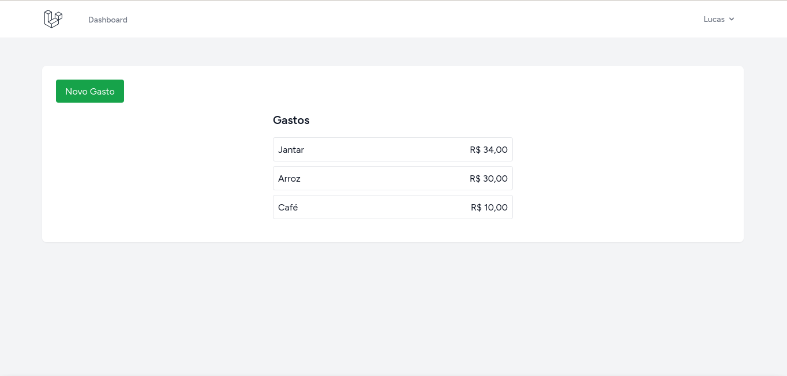

## Livewire + TDD

Ideias
- [x] Primeiro TDD com criação do Expenses
- [x] Por um componente Livewire index para chamar um botão create para chamar o CreateExpenses, exibir index com a tabela com dispath atualizando.
- [ ] Adicionar lib UI como tallstackUI

 
Resumo:

- Altere na config do Livewire `'legacy_model_binding' => true`, assim pode receber instancia de models e interagir com elas.`public Todos $todos;` 
- Para funcionar com @created="$refresh", e atualizar, é necessário ser filho diretamente. Exemplo: Componente Index irá renderizar a lista, dentro dele terá o botão de Criar.
- Use Computed para dados vindo do banco de dados.

